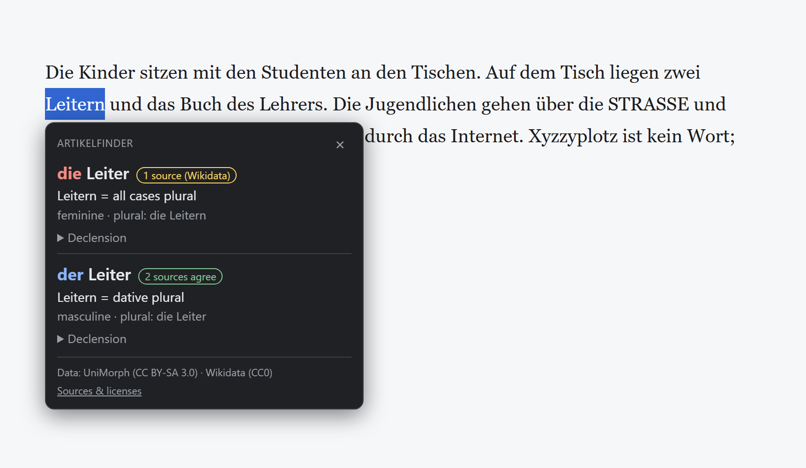
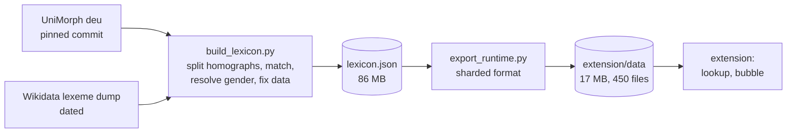

# ArtikelFinder

A browser extension that tells you **der, die or das** for any German noun you select on a
web page, including inflected forms (*Tischen* → *der Tisch*, dative plural). It shows every
possible reading instead of guessing, and says where each answer comes from.



- **Select a word → right-click → "Artikel für „…“"**, or press <kbd>Alt</kbd>+<kbd>Shift</kbd>+<kbd>A</kbd>.
- Article and lemma, what the selected form is (case and number), plural, full declension table.
- A certainty label on every answer: *2 sources agree*, *1 source*, *sources disagree*, *gender unknown*.
- Runs entirely offline. No server, no AI, no tracking. Permissions: context menu and the
  current tab at the moment you ask; **no "read all your data on all websites" warning**.

## Install (no build needed)

1. Download `artikelfinder-<version>.zip` from the
   **[latest release](https://github.com/souissinebilAI/ArtikelFinder/releases/latest)**.
   Use this file, not GitHub's green "Code → Download ZIP" button: that one is source code
   without the dictionary.
2. **Unzip it** (right-click → *Extract all…*). Keep the folder; the browser loads the
   extension from it every time.
3. Open `chrome://extensions` (Edge: `edge://extensions`), turn on **Developer mode**, click
   **Load unpacked** and choose the unzipped folder (the one that contains `manifest.json`).
4. Select a German word on any page → right-click → **Artikel für „…“**. If
   <kbd>Alt</kbd>+<kbd>Shift</kbd>+<kbd>A</kbd> does nothing, set a shortcut under
   `chrome://extensions/shortcuts` (Edge: `edge://extensions/shortcuts`).

To update: download the new zip, replace the folder's contents, press reload on the
extension card.

## Why this is harder than a dictionary lookup

German nouns inflect, and one written form can belong to several words:

| Selected | Readings |
|---|---|
| *Studenten* | der Student, 7 of 8 case/number slots (weak noun) |
| *Leitern* | die Leiter (ladder), all plural cases, **and** der Leiter (leader), dative plural |
| *See* | der See (lake) **and** die See (sea) |
| *Jugendlichen* | der/die Jugendliche: the gender depends on the person meant |

So the data model is `surface form → candidate[]`, never a 1:1 mapping, and the UI shows all
candidates. Choosing between them needs sentence-level parsing, which is out of scope for now
rather than faked with heuristics.

## Data: what the sources got wrong, and how it was measured

The dictionary is built from two open data sets:
[UniMorph German](https://github.com/unimorph/deu) (inflection tables) and
[Wikidata lexemes](https://www.wikidata.org/wiki/Wikidata:Lexicographical_data) (gender, more nouns).
Profiling them before trusting them turned up real defects:

- **UniMorph stores one gender per headword, not per word.** Every homograph with a different
  gender was wrong (it said *der* Tor for the gate; it is *das* Tor). Fixed by matching each
  inflection table to a Wikidata lexeme by overlap of its (case, number, form) cells,
  one-to-one, and refusing near-ties.
- **~2,000 UniMorph nouns had no gender** (*Richtung*, *Störung*), and **~1.6% had a wrong one**
  (*der* Dach). A hand-checked sample showed Wikidata right in nearly every disagreement; those
  stay labeled *sources disagree*.
- **UniMorph lacked core vocabulary.** On 200,000 sentences of German news and Wikipedia text,
  it knew only ~69% of the nouns (missing *Euro*, *Kritik*, *Internet*). Adding Wikidata-only
  nouns raised that to an estimated **~94%**.
- **~6,400 nouns listed only the archaic dative** "dem Tische", not "dem Tisch". Restored
  (Wikidata confirms the modern form for 99.5% of the affected nouns it covers).

Result: 196,248 inflection tables, 535,239 distinct word forms. Of the noun occurrences found
in real text, 66% have a gender backed by both sources' data (the same gender, or a Wikidata entry
matched to UniMorph's forms), 27% by Wikidata alone, 4% by UniMorph alone, and 1.6% are flagged
*sources disagree*.

## How it works



- **Build time (Python, standard library only):** sources → one lexicon with an evidence label
  per entry → compact runtime format.
- **Runtime format:** a Manifest V3 background worker is stopped after ~30 s idle, so anything
  loaded at startup is loaded again and again. The dictionary is split into 256 hashed index
  shards and 192 paradigm shards. A lookup reads about 150 KB and nothing is kept in memory.
  Forms are stored relative to the lemma (*Tisch* + `0es` = *Tisches*), which collapses the
  196k tables into **1,176 shared patterns**, effectively German declension classes. 86 MB → 17 MB.
- **Extension (plain JavaScript, no framework, no build step):** the lookup runs in the background
  worker. The result bubble is drawn in a closed Shadow DOM with text only, never HTML, so page
  styles cannot break it and user-editable source data cannot inject markup.

Design notes and trade-offs: [docs/MILESTONE1.md](docs/MILESTONE1.md). Full decision log: [CLAUDE.md](CLAUDE.md).

## Testing

- **Python** (`python -m unittest discover tests`): hand-verified grammar facts (the cases above
  and more); the runtime format checked against the full lexicon for all 535,239 word forms.
- **JavaScript** (`npm test`, Node's built-in runner, no dependencies): the JS reader must
  reproduce 3,040 lookups written by the Python reference reader, stratified by evidence label;
  input normalization; what the bubble shows; the background worker against a fake `chrome` API;
  and a test that fails if the manifest ever gains a permission.
- **Visual:** `extension/dev/harness.html` runs the real modules under deliberately hostile page
  CSS. **Real browser:** [docs/MANUAL_TEST.md](docs/MANUAL_TEST.md).

## Build and run

Requires Python 3.11+, Node 20+ (tests only), `git`, `curl`, `bzcat`.

```bash
git clone --recurse-submodules https://github.com/souissinebilAI/ArtikelFinder.git
cd ArtikelFinder
mkdir -p data/raw
curl -s https://dumps.wikimedia.org/wikidatawiki/entities/20260923/wikidata-20260923-lexemes.json.bz2 \
  | bzcat | python pipeline/extract_wikidata.py > data/raw/wikidata-de-nouns.jsonl
python pipeline/build_lexicon.py
python pipeline/export_runtime.py --out extension/data
```

Then open `chrome://extensions` (or `edge://extensions`), turn on Developer mode, click
**Load unpacked** and pick `extension/`. To run all tests and build a store-ready zip:

```bash
python pipeline/export_runtime.py && python tests/make_golden.py
python -m unittest discover tests && npm test
python pipeline/package_extension.py
```

Pinned source versions and rebuild notes: [data/SOURCES.md](data/SOURCES.md).

## Limitations

- **No sentence context.** *Leitern* shows both readings; picking one would need a parser.
- **Compound words** not in the dictionary (*Mannschaftskasse*) are not split yet. Selecting the
  last part (*kasse*) works.
- **ALL-CAPS "SS"** cannot be mapped back to "ß" (*STRASSE*). The bubble says so instead of guessing.
- **Names** (Berlin, Merkel) are not included.
- Chrome and Edge only so far. The keyboard shortcut may need to be set by hand if the browser
  already uses Alt+Shift+A.

## License

Code: [MIT](LICENSE) © 2026 souissinebilAI. Dictionary data: **CC BY-SA 3.0**, built from
UniMorph (CC BY-SA 3.0) and Wikidata (CC0). See [DATA_LICENSE.md](DATA_LICENSE.md).
